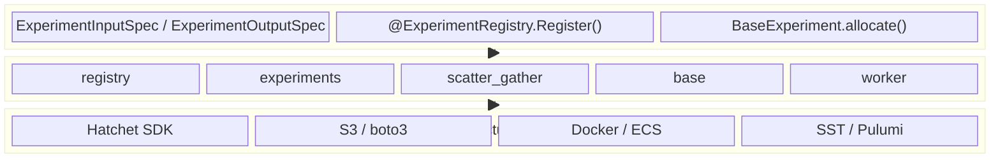
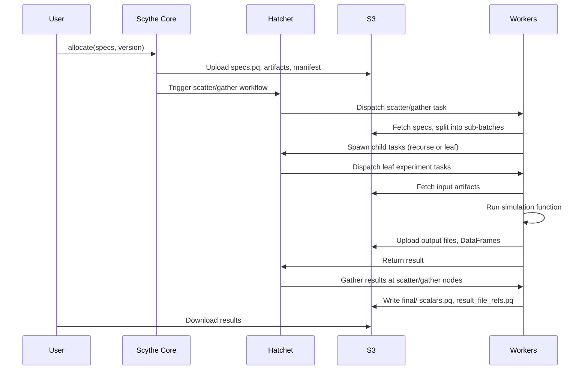
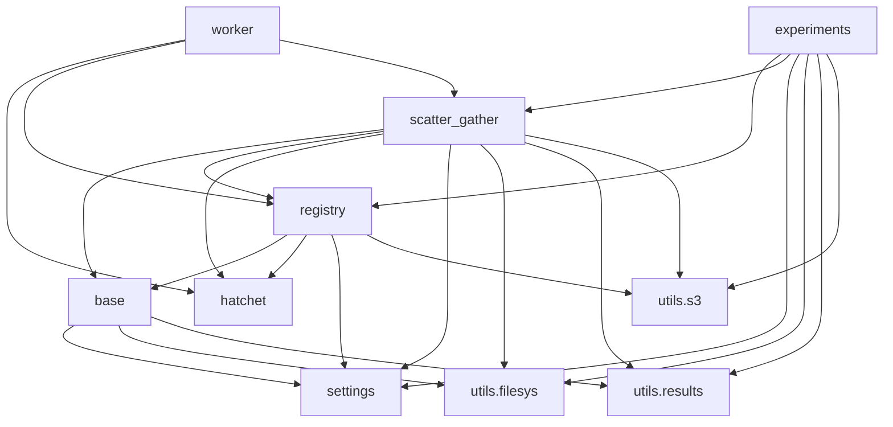

# Architecture

Scythe is organized into three layers: a **User Layer** that researchers interact with directly, a **Core Layer** that implements the experiment orchestration logic, and an **Infrastructure Layer** that provides the execution and storage backends.

## Three-Layer Overview

### User Layer

The user layer is what researchers and engineers interact with. It consists of three steps:

1. **Define schemas** -- Subclass `ExperimentInputSpec` and `ExperimentOutputSpec` with typed Pydantic fields that describe the inputs and outputs of a single simulation run.
2. **Register the experiment** -- Decorate your simulation function with `@ExperimentRegistry.Register()`, which wraps it in Hatchet task middleware.
3. **Allocate and run** -- Create a `BaseExperiment` and call `.allocate(specs, version=...)` to launch the experiment on a pool of workers.

No knowledge of queues, S3, serialization, or container orchestration is required.

### Core Layer

The core layer is composed of five modules that implement experiment orchestration:

| Module           | Responsibility                                                                                                                                                                   |
| ---------------- | -------------------------------------------------------------------------------------------------------------------------------------------------------------------------------- |
| `base`           | `ExperimentInputSpec`, `ExperimentOutputSpec`, `BaseSpec` -- schema base classes with file reference handling, MultiIndex construction, scalar extraction, and artifact transfer |
| `registry`       | `ExperimentRegistry` -- decorator that wraps user functions in Hatchet tasks with pre/post middleware (artifact fetch, temp directory, S3 upload, DataFrame serialization)       |
| `experiments`    | `BaseExperiment`, `VersionedExperiment`, `ExperimentRun`, `SemVer` -- allocation, versioning, S3 layout, manifest generation, and result retrieval                               |
| `scatter_gather` | `ScatterGatherInput`, `RecursionMap`, `ScatterGatherResult` -- recursive fan-out/fan-in workflow with grid-stride partitioning and Parquet-based payload transfer                |
| `worker`         | `ScytheWorkerConfig` -- worker configuration with role flags (`DOES_FAN`, `DOES_LEAF`), affinity labels, and environment-aware naming                                            |

### Infrastructure Layer

Scythe delegates execution and storage to external systems:

- **Hatchet** -- The distributed task engine that handles workflow scheduling, retries, durable execution, and worker coordination.
- **S3 (via boto3)** -- Object storage for experiment specs, input artifacts, intermediate scatter/gather payloads, and final result Parquet files.
- **Docker / ECS** -- Containerization and orchestration of worker processes, from local Docker Compose to AWS ECS with Fargate spot capacity.
- **SST / Pulumi** -- Infrastructure-as-code tools for provisioning cloud resources (VPCs, clusters, services, buckets).

## Data Flow

The following diagram shows how data moves through the system during an experiment:

## Module Dependency Graph

