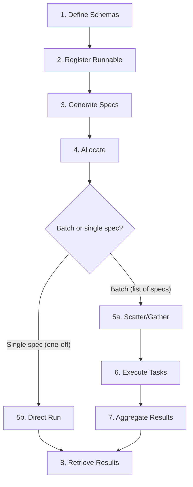

# Experiment Lifecycle

This page describes the full lifecycle of a Scythe experiment, from schema definition to result retrieval.

## Overview



## 1. Define Schemas

You create two Pydantic models:

- **`ExperimentInputSpec`** -- Defines the fields that parameterize each simulation run. These become the columns of the input DataFrame and the MultiIndex of the output DataFrames. Subclasses can also override `computed_features` to add derived index levels.
- **`ExperimentOutputSpec`** -- Defines the scalar output fields and optional `FileReference` outputs. Scalar fields become columns of `scalars.pq`; file reference fields become columns of `result_file_refs.pq`.

Both support `FileReference` fields (`S3Url | HttpUrl | pathlib.Path`) for handling file-based inputs and outputs.

## 2. Register the Runnable

There are two ways to register runnables with Scythe:

**Standalone tasks** -- The `@ExperimentRegistry.Register()` decorator transforms your simulation function into a Hatchet `Standalone` task. The decorator:

- Inspects the function signature to extract input/output types
- Wraps the function in middleware that handles artifact fetching, temp directories, and result uploading
- Registers the task with the global `ExperimentRegistry`

The function must accept an `ExperimentInputSpec` subclass as its first argument and return an `ExperimentOutputSpec` subclass. It may optionally accept a `tempdir: Path` second argument.

**Workflow runnables** -- `ExperimentRegistry.Include()` registers an existing Hatchet `Workflow` object. This is useful for multi-step pipelines or complex DAGs that go beyond a single function. See [Workflow & Single-Run Experiments](../guides/workflow-experiments.md) for details.

## 3. Generate Specs

You generate a population of input specs using whatever sampling strategy suits your experiment -- random sampling, Latin hypercube, full factorial, etc. Each spec is an instance of your `ExperimentInputSpec` subclass.

The `experiment_id` and `sort_index` fields are inherited from the base class. You can set them to placeholders since `allocate()` will overwrite them with the resolved experiment ID and sequential indices.

## 4. Allocate

Calling `BaseExperiment.allocate()` performs the following steps:

1. **Resolve version** -- Based on the versioning strategy (`bumpmajor`, `bumpminor`, `bumppatch`, `keep`) and the latest version found in S3.
2. **Validate specs** -- Checks that all specs match the expected input type for the registered runnable.
3. **Overwrite metadata** -- Sets `experiment_id` and `sort_index` on each spec.
4. **Upload input artifacts** -- Finds all local `Path` values in `FileReference` fields, uploads them to S3, and rewrites the references as `S3Url` values.
5. **Serialize specs** -- Writes all specs to a `specs.pq` Parquet file in S3.
6. **Trigger execution** -- The behavior depends on how specs are passed:
   - **Batch (Sequence of specs)**: Creates a `ScatterGatherInput` and triggers the scatter/gather workflow on Hatchet.
   - **Single spec (one-off run)**: Triggers the runnable directly on Hatchet, bypassing scatter/gather entirely. A `workflow_spec.yml` is also uploaded. This works with both `Standalone` and `Workflow` runnables.
7. **Write metadata** -- Uploads `manifest.yml`, `experiment_io_spec.yml`, and `input_artifacts.yml` to the experiment run directory.

The return value is a tuple of `(ExperimentRun, ref)`, where `ref` is a `TaskRunRef` (for batch scatter/gather runs) or a `WorkflowRunRef` (for single-spec runs). Both can be used to wait for the result.

## 5. Scatter/Gather or Direct Execution

**For batch allocations (list of specs):** The scatter/gather workflow receives the full spec URI and recursion configuration. At each node:

- **If base case** (few enough specs or max depth reached): dispatch individual experiment tasks via `run_many` and collect results.
- **Otherwise**: split specs using grid-stride, serialize sub-batches to S3, and spawn child scatter/gather workflows.

See [Scatter/Gather](scatter-gather.md) for details on the recursive tree structure.

**For single-spec allocations (one-off runs):** The runnable is triggered directly on Hatchet. Scatter/gather is bypassed entirely. This works with both `Standalone` tasks and multi-step `Workflow` pipelines. See [Workflow & Single-Run Experiments](../guides/workflow-experiments.md) for details.

## 6. Execute Tasks

Each leaf experiment task:

1. Receives the input spec (including `storage_settings` and `workflow_run_id`)
2. Optionally replaces the `log` method with Hatchet's context logger
3. Fetches remote file references to a local cache (or temp directory)
4. Calls your simulation function
5. Extracts scalar outputs into a DataFrame row with a MultiIndex from the input spec fields and any `computed_features`
6. Uploads any output `FileReference` files to S3 and records their URIs
7. Uploads any additional DataFrames to S3
8. Returns the serialized output spec

## 7. Aggregate Results

As experiment tasks complete, the scatter/gather nodes collect their outputs:

- Results from leaf tasks are combined using `transpose_dataframe_dict`, which concatenates DataFrames by key.
- Results from child scatter/gather nodes are fetched from their S3 output URIs and merged.
- The root node writes the final aggregated DataFrames to the `final/` directory.

## 8. Retrieve Results

After the experiment completes, results are available in S3 at:

```
<bucket>/<prefix>/<experiment_name>/<version>/<timestamp>/final/
├── scalars.pq
├── result_file_refs.pq
└── <user-defined>.pq
```

You can retrieve results programmatically:

```python
from scythe.experiments import BaseExperiment

experiment = BaseExperiment(runnable=my_experiment_fn)

# List all versions
versions = experiment.list_versions()

# Get the latest version
latest = experiment.latest_version()

# Get result file keys for the latest run
results = experiment.latest_results
# e.g. {"scalars": "prefix/.../final/scalars.pq", ...}
```

The `scalars.pq` file contains a DataFrame where:

- The **index** is a `MultiIndex` built from the input spec fields (excluding non-serializable fields like `FileReference` and `storage_settings`)
- The **columns** are the scalar output fields from `ExperimentOutputSpec`

This structure makes it straightforward to load results into pandas for analysis, filtering, and visualization.
