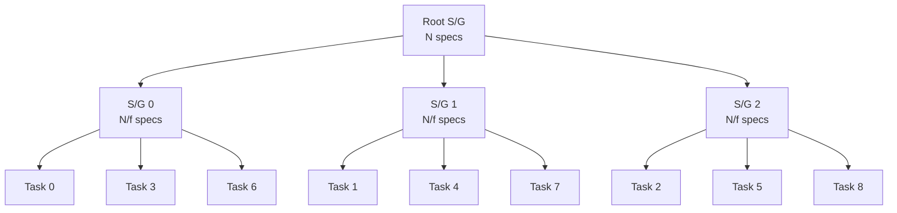

# Scatter/Gather

!!! note
Scatter/gather is the execution path for **batch allocations** (a list of specs) only. When you pass a single spec to `allocate()`, the runnable is triggered directly on Hatchet and scatter/gather is bypassed. See [Workflow & Single-Run Experiments](../guides/workflow-experiments.md) for that path.

Scythe uses a recursive scatter/gather pattern to parallelize both the dispatch and collection of experiment tasks. This allows it to scale from tens to millions of simulations without bottlenecking on a single node.

## The Problem

When running a large experiment (e.g. 1,000,000 simulations), a naive approach would have a single orchestrator enqueue all tasks sequentially and then wait for all results. This creates two bottlenecks:

1. **Dispatch throughput** -- Enqueueing millions of tasks from a single process is slow.
2. **Result collection** -- Gathering and combining millions of individual result payloads overwhelms a single node's memory and network bandwidth.

## The Solution: Recursive Tree

Scythe solves this with a tree of scatter/gather nodes. A root node splits the full spec list into sub-batches and delegates each sub-batch to a child scatter/gather node. Each child repeats the process until reaching a base case, at which point it dispatches the actual experiment tasks and collects their results.



In this example with `factor=3` and `max_depth=1`, the root splits 9 specs into 3 groups of 3, each handled by a child scatter/gather node that runs the actual experiments.

## Grid-Stride Distribution

Specs are not distributed in contiguous blocks. Instead, Scythe uses a **grid-stride** pattern: child _k_ of a node with branching factor _f_ receives specs at indices _k, k+f, k+2f, ..._ from the parent's spec list.

This ensures that if specs are ordered by some meaningful criterion, each child gets a representative sample rather than a contiguous chunk. It also distributes work more evenly when simulations have variable runtimes correlated with their position in the spec list.

## RecursionMap

The `RecursionMap` model controls the shape of the scatter/gather tree:

```python
from scythe.scatter_gather import RecursionMap

recursion_map = RecursionMap(
    factor=10,      # each node fans out to 10 children
    max_depth=2,    # at most 2 levels of recursion before running experiments
)
```

| Parameter   | Description                                                                                         |
| ----------- | --------------------------------------------------------------------------------------------------- |
| `factor`    | The branching factor -- how many children each scatter/gather node creates.                         |
| `max_depth` | The maximum recursion depth. At depth 0, the root node runs experiments directly with no recursion. |
| `path`      | (Internal) Tracks the current position in the recursion tree. You do not set this directly.         |

### Base Case

A scatter/gather node reaches the base case and runs experiments directly when either:

- The number of remaining specs is less than or equal to `factor`
- The current recursion depth has reached `max_depth`

### Choosing Parameters

- For **small experiments** (< 100 specs), use `max_depth=0` (no recursion) -- the root runs all tasks directly.
- For **medium experiments** (100 -- 10,000 specs), use `factor=10, max_depth=1` -- a single level of fan-out.
- For **large experiments** (> 10,000 specs), use `factor=10, max_depth=2` or higher.
- The total fan-out capacity at the leaves is `factor^(max_depth)` nodes, each running `N / factor^(max_depth)` experiments.

## Payload Transfer via S3

Hatchet has a ~4 MB payload size limit. Since experiment specs can be large (especially with many fields or large populations), Scythe stores spec data as Parquet files in S3 and passes only the S3 URI in the Hatchet payload.

At each level of the scatter/gather tree:

1. The parent serializes each child's sub-batch of specs as a Parquet file in `scatter-gather/input/`.
2. Each child downloads its spec Parquet file from S3 upon starting.
3. After running experiments, each child uploads its result DataFrames to `scatter-gather/output/`.
4. The root node writes the final aggregated results to `final/`.

## Result Aggregation

Results flow upward through the tree. Each scatter/gather node:

1. Collects the output DataFrames from its children (either leaf experiment results or child scatter/gather results)
2. Concatenates them by key (e.g. `scalars`, `result_file_refs`, user-defined DataFrames)
3. Uploads the combined DataFrames to S3

The root node writes the final combined DataFrames to the `final/` directory, producing the experiment's output files:

- `final/scalars.pq` -- All scalar output values
- `final/result_file_refs.pq` -- URIs of output file references
- `final/<name>.pq` -- Any user-defined DataFrames
