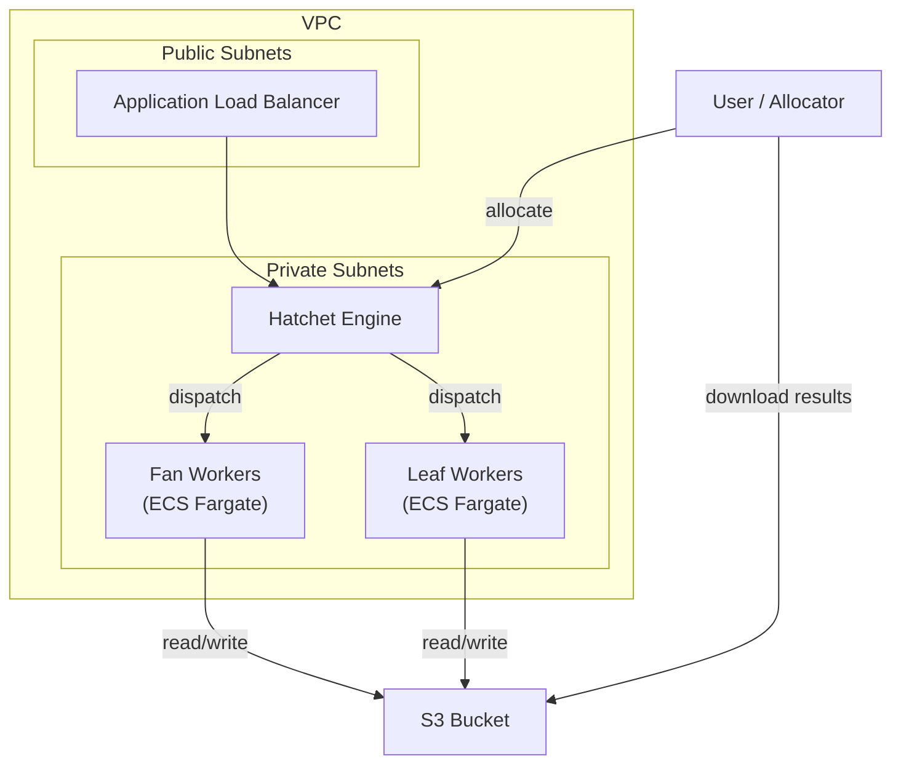

# Cloud Deployment (AWS)

This guide covers deploying Scythe workers to AWS using ECS (Elastic Container Service) with Fargate, and optionally self-hosting Hatchet.

## Architecture Overview

A production Scythe deployment on AWS consists of:



- **Hatchet** orchestrates task scheduling, retries, and worker coordination
- **Leaf workers** run the actual simulation experiments
- **Fan workers** handle scatter/gather orchestration
- **S3** stores all specs, artifacts, and results

## ECS with SST

[SST](https://sst.dev) (or [Pulumi](https://www.pulumi.com/)) makes it straightforward to provision the required AWS infrastructure as code. Below is an example SST configuration for deploying Scythe workers.

### Worker Services

Define separate services for leaf (simulation) and fan (scatter/gather) workers:

```typescript title="infra/sst.config.ts"
// Leaf workers -- run actual simulations
const simulations = new sst.aws.Service("Simulations", {
  cluster: cluster.arn,
  vpc: { id: vpc.id, securityGroups: [sg.id], subnets: privateSubnets },
  cpu: "2 vCPU",
  memory: "8 GB",
  architecture: "x86_64",
  image: { dockerfile: "Dockerfile.worker" },
  capacity: [{ spot: { weight: 100 } }],
  scaling: { min: 0, max: 100 },
  link: [bucket],
  environment: {
    SCYTHE_WORKER_DOES_LEAF: "True",
    SCYTHE_WORKER_DOES_FAN: "False",
    SCYTHE_WORKER_SLOTS: "1",
    SCYTHE_STORAGE_BUCKET: bucketName,
    SCYTHE_STORAGE_BUCKET_PREFIX: "my-project",
    SCYTHE_TIMEOUT_SCATTER_GATHER_SCHEDULE: "10h",
    SCYTHE_TIMEOUT_SCATTER_GATHER_EXECUTION: "10h",
    SCYTHE_TIMEOUT_EXPERIMENT_SCHEDULE: "10h",
    SCYTHE_TIMEOUT_EXPERIMENT_EXECUTION: "30m",
    HATCHET_CLIENT_TOKEN: hatchetToken,
  },
});

// Fan workers -- scatter/gather orchestration
const fanouts = new sst.aws.Service("Fanouts", {
  cluster: cluster.arn,
  vpc: { id: vpc.id, securityGroups: [sg.id], subnets: privateSubnets },
  cpu: "4 vCPU",
  memory: "24 GB",
  architecture: "x86_64",
  image: { dockerfile: "Dockerfile.worker" },
  capacity: [{ spot: { weight: 100 } }],
  scaling: { min: 0, max: 10 },
  link: [bucket],
  environment: {
    SCYTHE_WORKER_DOES_LEAF: "False",
    SCYTHE_WORKER_DOES_FAN: "True",
    SCYTHE_WORKER_SLOTS: "4",
    SCYTHE_TIMEOUT_SCATTER_GATHER_SCHEDULE: "10h",
    SCYTHE_TIMEOUT_SCATTER_GATHER_EXECUTION: "10h",
    SCYTHE_TIMEOUT_EXPERIMENT_SCHEDULE: "10h",
    HATCHET_CLIENT_TOKEN: hatchetToken,
  },
});
```

### Key Configuration Choices

**Spot capacity** -- Using `capacity: [{ spot: { weight: 100 } }]` runs workers on Fargate Spot, which costs ~70-75% less than on-demand. Hatchet's durable execution and retry mechanisms handle spot interruptions gracefully.

**Separate scaling** -- Leaf workers scale based on simulation demand (potentially to hundreds of instances), while fan workers need far fewer instances since scatter/gather is I/O-bound.

**Resource allocation** -- Leaf workers are sized for simulation requirements (CPU/memory). Fan workers need more memory for loading and splitting large spec DataFrames but less CPU.

## Self-Hosting Hatchet

For production deployments, you may want to self-host Hatchet rather than using Hatchet Cloud. The [hatchet-sst](https://github.com/szvsw/hatchet-sst) repository provides an SST configuration for deploying Hatchet on AWS, including:

- VPC with public and private subnets
- ECS cluster with Hatchet engine, API, and dashboard services
- RDS PostgreSQL database
- ElastiCache or self-hosted RabbitMQ for the message broker
- EFS for shared storage
- Application Load Balancer for external access

A self-hosted Hatchet deployment costs approximately $13/day on AWS and provides full control over the infrastructure.

!!! tip
For development and testing, [Hatchet Cloud](https://cloud.hatchet.run) is the easiest option. Self-hosting is mainly beneficial for production workloads where you need data locality, cost optimization, or compliance requirements.

## Networking

### VPC Configuration

Workers need network access to:

1. **Hatchet** -- For task scheduling and coordination (gRPC/HTTP)
2. **S3** -- For reading/writing specs, artifacts, and results

If self-hosting Hatchet in the same VPC, workers can use private networking. For Hatchet Cloud, workers need outbound internet access (via NAT gateway or public subnets).

### Security Groups

- Workers: Allow outbound to Hatchet (port 443 for Cloud, or internal ports for self-hosted) and S3 (HTTPS)
- Hatchet (if self-hosted): Allow inbound from workers and your allocator client

## S3 Bucket

Create an S3 bucket for experiment data. Scythe uses a configurable prefix within the bucket:

```typescript
const bucket = new sst.aws.Bucket("ExperimentData");
```

Workers need IAM permissions for `s3:GetObject`, `s3:PutObject`, and `s3:ListBucket` on the bucket.

## Deployment Workflow

A typical deployment workflow:

1. **Build** the worker Docker image with your experiment code
2. **Push** to ECR (Amazon Elastic Container Registry)
3. **Deploy** the SST stack, which creates/updates the ECS services
4. **Allocate** experiments from your local machine or a CI/CD pipeline

SST handles the build/push/deploy cycle:

```sh
npx sst deploy --stage production
```

## Cost Optimization

- **Fargate Spot** -- ~75% cost reduction over on-demand
- **Scale to zero** -- Set `scaling.min: 0` for workers that only run during experiments
- **Right-size resources** -- Profile your simulations and allocate only the CPU/memory needed
- **Self-host Hatchet** -- Avoid per-task pricing for very large experiments
- **S3 lifecycle policies** -- Archive or delete old experiment data automatically

## Next Steps

- See [Local Development](local.md) for getting started locally before deploying to the cloud
- See the [hatchet-sst](https://github.com/szvsw/hatchet-sst) repository for the full Hatchet self-hosting configuration
- See [Workers](../guides/workers.md) for detailed worker configuration options
